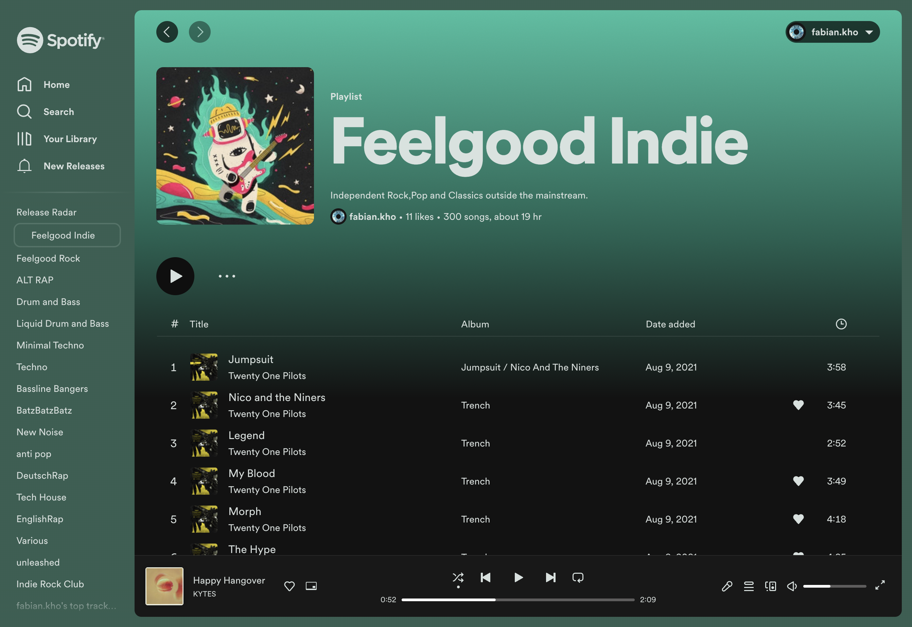

  <h1>Spotify Arc</h1>
  
  Beautiful theme, inspired by [Dribblish Spicetify](https://github.com/spicetify/spicetify-themes/tree/master/Dribbblish), which automatically adapts to  your arc theme.

## Feautures 💣

- New releases in Sidebar. (link to [spotify release list](https://spotifyreleaselist.netlify.app/) )
- removed annoying "Install App" button.
- cleaned UI

## How to install

### Create a new Boost

1. Go to spotify.com.
2. Click the little + on the bottom of the Sidebar or press `command` + `t` and type "new boost".
3. Choose "Custom" and then "A specific Website".
4. Make sure the url is "spotify.com" and press "Create Boost"

### Add Spotify Arc

1. Go the [source folder](/src) and copy the content of styles.css and paste it into the styles.css file of your new boost.
2. Next do the same for the content.js file.
3. You're done! Enjoy 👋

## Tips ✏️

#### Do you want to set Icons for this extension?
 1. Press `command` + `t` and type "manage Extensions"
 2. search for the spotify extension and press `Details`
 3. Scroll down to "Source" and click on the path. (Finder should open)
 2. Now update your "manifest.json" with the one provided in this repo and add the two icon files to your extension folder. 

#### Is your Background to bright to see the font properly?
 -> Go to "styles.css" and change the variable `--contrast-color` to your needs.
 
 
## Issues ❓
If you ran into any issues please create an Issue and attach an screenshot.
