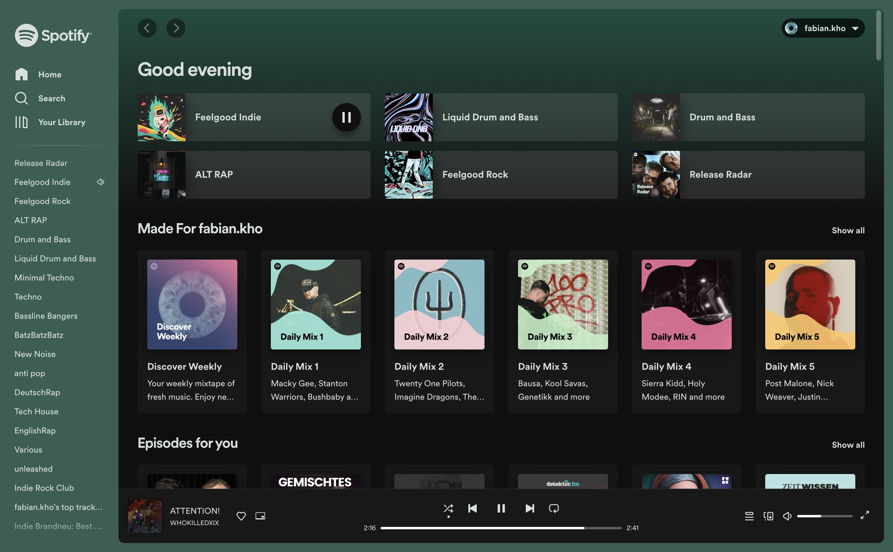

# Spotify Arc

### How to install

#### Create a new Boost

1. Go to spotify.com.
2. Click the little + on the bottom of the Sidebar or press `command` + `t` and type "new boost".
3. Choose "Custom" and then "A specific Website".
4. Make sure the url is "spotify.com" and press "Create Boost"

#### Add Spotify Arc

1. Go the the [source folder](/src) and copy the content of styles.css and paste it into the styles.css file of your new boost.
2. Next do the same for the content.js file.
3. You're done! Enjoy 👋
